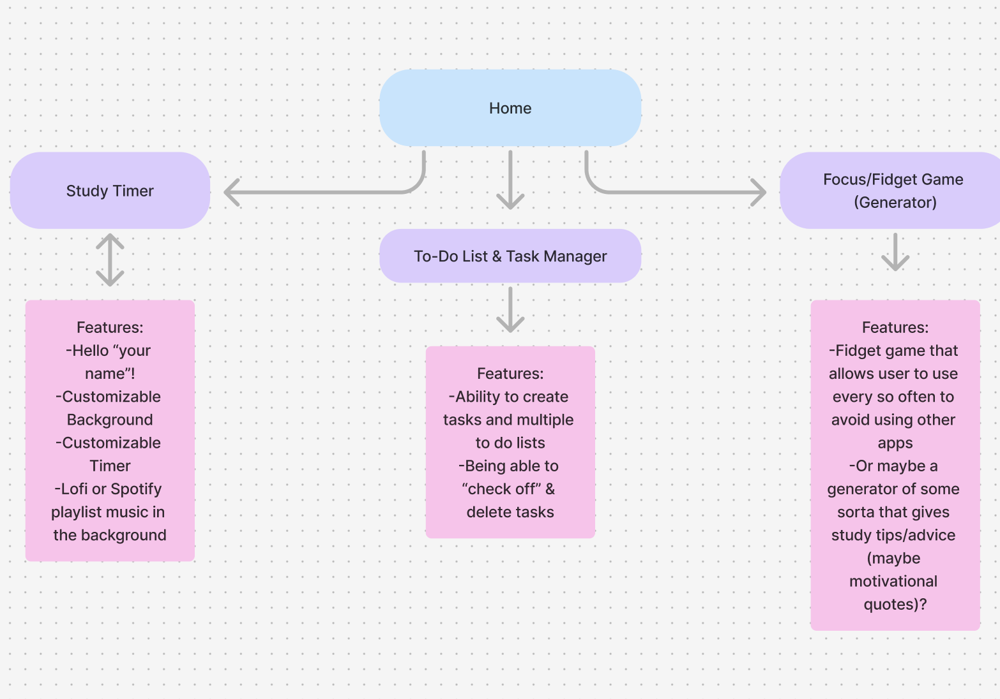

# Midterm Proposal
- Concept/Theme of Site: A study buddy website! Allows for personalized background, timer, and more! Other features I am thinking about: 'Study with me' youtube links page, maybe a fidget game (sometimes I get distracted and having a fidget toy really helps)?, page for to-do lists, study quiz on how you feel about your progress
- Inspiration:
	
    
    
    
- Concepts|skills we have covered that you will use to build your site: HTML & CSS to create coherent backgrounds, using images to create aesthethic backgrounds, nav bars and links to navigate between different areas of my website
- Concepts|skills you need to still learn to complete the project: interactivity to create a customizable background and timer, toggle list for to-do tasks, and (maybe its too much but maybe a simple game or quiz to see "how much of a procrastinator you are?")

- Wireframe/sitemap:

